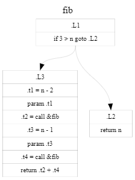

# KCS (Kray-G C Script) [](LICENSE)

Scripting in C with JIT(x64)/VM.

## Overview

### Features

The main feature is below.

*   The language is C, so it is easy to use for almost all programmers.
*   You can execute the code on the fly with JIT or VM like a scripting.
*   KCS provides a standard C library.
    *   Not completed so far, though. 
    *   See [doc/cstdlib.md](doc/cstdlib.md) for the current status.
*   KCS also provides useful libraries by default like regex, zip, encryption, and so on.
    *   See [doc/extension.md](doc/extension.md) for extended library interface.
    *   See the [samples](samples) because there are some samples about how to use.
    *   Some libraries will be coming soon.
    *   Please let me know if you have library which you want to use.

FYI, please see the [technical notes](doc/technical.md)
if you have any interest in what I have done in the development.
Current topics are below.

*   Loop condition at the bottom of loop
*   Binary search for switch-case
*   Jump table for switch-case
*   Calling convention between Microsoft x64 and System V

### Why not using Clang?

Clang is too big for a light use.
KCS's goal is a lightweight and easy to use.
If you want to do JIT with Clang, see [clang-jit][] project for your help.

[clang-jit]: https://github.com/Kray-G/clang-jit

## Getting Started

### Prerequisites

Now KCS was tested only on a platform below.

*   Windows (x64) with Visual Studio 2017 (Express Edition).
*   Linux (x64) with gcc.

I am waiting for pull requests to support any other platforms & compilers.

### Building & Testing

**Notes for executing:**

To execute `kcc` on Linux or `kcc.exe` on Windows, the files below are required.
Especially for `kccrt` folder will be used at runtime.

```
+-- (installed)
    +-- kccrt
    |   +-- include/*
    |   +-- libsrc/*
    +-- kcc                 (kcc.exe)
    +-- libkcc.so           (libkcc.dll)
    +-- kccbltin.so         (kccbltin.dll)
    +-- kccjit.so           (kccjit.dll)
    +-- kccext.so           (kccext.dll)
```

#### Windows

After installing Visual Studio and prepareing an environment, do make & test as below.

```
C:> make.cmd all test
```

#### Linux

Do make & test KCS on Linux x64 as below.

```
$ make all test
```

### Architecture

Here is the basic block diagram of KCS.

```
+-----------------------------------------------------------+
|                                                           |
|                        Your C Code                        |
|                                                           |
+-----------------------------+-----------------------------+
                             ---
+-----------------------------+-----------------------------+
| KCS - Kray-G C Compiler & Interpreter                    |
|                                                           |   +---------------------------------------+
|   +---------------------------------------------------+   |   |  stdio, stdlib, string...             |
|   |                   Library Code                    +-------+    bigint, regex, xml, json...        |
|   +---------------------------------------------------+   |   |      zip/unzip, sqlite3, libcurl...   |
|                                                           |   +-------------------+-------------------+
|   +-----------------------+   +-----------------------+   |                       |
|   |     JIT builtin       |   |     VM builtin        |   |   +-------------------+-------------------+
|   |        kccjit.dll     |   |       kccbltin.dll    |   |   |             Extension DLL             |
|   +-----------------------+   +-----------------------+   |   |                  kccext.dll           |
|   +-----------------------+   +-----------------------+   |   +---+-----------------------------------+
|   |     JIT Executor      |   |    VM Interpreter     |   |       |       |       |       |       |
|   +-----------+-----------+   +-----------+-----------+   |   +-------+   :       :       :       :
|               |                           |               |   | Some  |   .       .       .       .
|   +===========+=============+=============+===========+   |   |   OSS |   . . . . . . . . . . . . . . .
|   |     x86_64 Compiler     |       VM Compiler       |   |   +-------+
|   |                      Backend                      |   |
|   +-------------------------+-------------------------+   |
|   |                                                   |<------ Based on lacc
|   |                        [ Modified *lacc* core ]   |   |       with additional VM backends.
|   +===================================================+   |
|                                                           |
+-----------------------------------------------------------+

```

## Usage

### Command Line Interface

#### Run Options

The option `-x` will be used by default when no option specified.

```
-x          Run by VM code. (use this when no options specified)
-j          Run by x64 JIT code.
```

#### Input Options

```
-I          Add directory to search for included files.
-D X[=]     Define macro, optionally with a value.
```

#### Output Options

The program will be not run when using one of output options.

```
-E          Output preprocessed code to stdout.
-J          Output x64 code assembled by JIT to stdout.
-X          Output VM code to stdout.
-s          Output GNU style textual x64 assembly to `.s` file.
-dot        Output IR call flow graph in dot format to `.dot` file.
```

## Examples

### How to Run

#### Run on the x64 JIT

For JIT use the option `-j`.
Use the option `-J` if you want to see the x64 assembly code.

```c
// Run on the x64 JIT.
$ kcc -j program.c
// Show the x64 assembly code.
$ kcc -J program.c
```

#### Run on the VM

No options or use the option `-x` to run on the VM.
Use the option `-X` if you want to see the VM instructions.

```c
// Run on the VM.
$ kcc program.c
$ kcc -x program.c
// Show the VM instruction code.
$ kcc -X program.c
```

### Output Call Flow Graph

This is `lacc`'s functionality, but `kcc` can do it also.
Here is the output of call flow graph for switch-case assembled as a jump table.
Please see [here](doc/technical.md) for the detail of a jump table.


### Fibonacci

#### Source Code

```c
#include <stdio.h>

int fib(int n)
{
    if (n < 3) return n;
    return fib(n-2) + fib(n-1);
}

int main()
{
    return printf("%d\n", fib(34));
}
```

#### Dot Output

Although the labels, variable names, and line breaks have been changed for easy to understand,
the output is like below.

```c
digraph {
    node [fontname="Courier_New",fontsize=10,style="setlinewidth(0.1)",shape=record];
    edge [fontname="Courier_New",fontsize=10,style="setlinewidth(0.1)"];
    label="fib"
    labelloc="t"
    L1 [label="{ \.L1 | if 3 \> n goto \.L2 }"];
    L3 [label="{ \.L3 | .t1 = n - 2 | param .t1 | .t2 = call &fib |
                        .t3 = n - 1 | param .t3 | .t4 = call &fib | return .t2 + .t4 }"];
    L2 [label="{ \.L2 | return n }"];
    L1:s -> L3:n;
    L1:s -> L2:n;
}
```

The image is like this.



#### Execution Sample

The results are below.

```c
$ kcc -j fib.c
9227465

$ kcc fib.c
9227465
```

#### Benchmark

Maybe it will depend on the environment.
Here is one of samples on Windows, and it is an execution time in seconds.
For the reference, it shows a result of Ruby and Python.

|           | KCS VM(64bit) | KCS JIT(x64) | Ruby 2.4.0 | Ruby 2.6.3 | Python 2.7.13 |
| --------- | :------------: | :-----------: | :--------: | :--------: | :-----------: |
| `fib(34)` |     0.453      |   **0.062**   |   1.171    |   0.734    |     1.578     |

I was able to make my VM faster than Ruby this time,
but Ruby 2.6.3 is very fast against my expectations in spite of no type information.
Of course x64 JIT code is 7x or 8x faster than that VM code.

#### Compiled Code

Here is a compiled x64 code and a VM instructions.
Those are very long and it includes also lots of library code,
so it shows the fib function only.

##### x64 assembly code

```asm
$ kcc -J fib.c
...(omitted)...
                                  fib
0000C2F3: 55                            pushq   %rbp
0000C2F4: 48 89 E5                      movq    %rsp, %rbp
0000C2F7: 53                            pushq   %rbx
0000C2F8: 41 54                         pushq   %r12
0000C2FA: 41 55                         pushq   %r13
0000C2FC: 41 56                         pushq   %r14
0000C2FE: 48 83 EC 10                   subq    $16, %rsp
0000C302: 89 7D D8                      movl    %edi, -40(%rbp)
                                  .L2453
0000C305: 83 7D D8 03                   cmpl    $3, -40(%rbp)
0000C309: 0F 8D 10 00 00 00             jge     .L2455
                                  .L2454
0000C30F: 8B 45 D8                      movl    -40(%rbp), %eax
0000C312: 48 8D 65 E0                   leaq    -32(%rbp), %rsp
0000C316: 41 5E                         popq    %r14
0000C318: 41 5D                         popq    %r13
0000C31A: 41 5C                         popq    %r12
0000C31C: 5B                            popq    %rbx
0000C31D: C9                            leave
0000C31E: C3                            ret
                                  .L2455
0000C31F: 8B 45 D8                      movl    -40(%rbp), %eax
0000C322: FF C8                         decl    %eax
0000C324: FF C8                         decl    %eax
0000C326: 89 C3                         movl    %eax, %ebx
0000C328: 89 DF                         movl    %ebx, %edi
0000C32A: E8 C4 FF FF FF                call    fib
0000C32F: 41 89 C4                      movl    %eax, %r12d
0000C332: 8B 45 D8                      movl    -40(%rbp), %eax
0000C335: FF C8                         decl    %eax
0000C337: 41 89 C5                      movl    %eax, %r13d
0000C33A: 44 89 EF                      movl    %r13d, %edi
0000C33D: E8 B1 FF FF FF                call    fib
0000C342: 41 89 C6                      movl    %eax, %r14d
0000C345: 44 89 F0                      movl    %r14d, %eax
0000C348: 44 01 E0                      addl    %r12d, %eax
0000C34B: 48 8D 65 E0                   leaq    -32(%rbp), %rsp
0000C34F: 41 5E                         popq    %r14
0000C351: 41 5D                         popq    %r13
0000C353: 41 5C                         popq    %r12
0000C355: 5B                            popq    %rbx
0000C356: C9                            leave
0000C357: C3                            ret
...(omitted)...
```

##### VM instructions

```asm
$ kcc -X fib.c
...(omitted)...
----------------------------------------------------------------
fib
      7979:     enter                   32
  .L2405
      7980:     push(32)                3 (0x3)
      7981:     push                    [BP-24] : n(i32)
      7982:     gt                      (i32)
      7983:     jnz                     * +14 <.L2406>
  .L2407
      7984:     push                    [BP-24] : n(i32)
      7985:     dec                     (i32)
      7986:     dec                     (i32)
      7987:     call                    * 7979 <fib>
      7988:     cleanup                 (8)
      7989:     pop                     [BP+8] : .t945(i32)
      7990:     push                    [BP-24] : n(i32)
      7991:     dec                     (i32)
      7992:     call                    * 7979 <fib>
      7993:     cleanup                 (8)
      7994:     push                    [BP+8] : .t945(i32)
      7995:     add                     (i32)
      7996:     ret                     (4)
  .L2406
      7997:     push                    [BP-24] : n(i32)
      7998:     ret                     (4)
...(omitted)...
```

###

## Todo List

I have a plan to do the followings when I have a time.

*   [ ] Providing all of Standard C Library.
*   [ ] Adding a library of XML Parser.
*   [ ] Adding a library with libCurl.
*   [ ] Supporting encryption of Zip/Unzip.
*   [ ] Adding [JSONPath][] for JSON parser.

[JSONPath]: http://goessner.net/articles/JsonPath/

## License

This project is licensed under the **MIT License** - see the [LICENSE](LICENSE) file for details.
For the licenses of libraries used internally, see [doc/licenses](doc/licenses) folder.

## Acknowledgments

I am very appreciative of many Open Source projects.

In particular, [lacc][], which is a very compact C compiler,
has a frontend and a backend separated well.
That was why I could add a VM very easily.
In fact I wrote my own C parser at first,
but I replaced it by [lacc][] because it was very easy to add a new backend.

Note that a lot of modifications were done for the old code base of [lacc][],
so it can not apply the latest one.
The main modifications are:

*   For Windows JIT, adapting calling convention between Microsoft x64 and System V.
*   Linking the compiled function for JIT on the fly.
*   Replacing types to build it with Visual Studio.
*   Some bug fixes.

And special thanks to the following products for useful test & sample codes.

*   Test Code
    *   [lacc][] (MIT License)
    *   [8cc][] (MIT License)
    *   [qcc][] (MIT License)
    *   [picoc][] (BSD License)
    *   [algo-c][] (CC0) - in Japanese

[lacc]: https://github.com/larmel/lacc/
[8cc]: https://github.com/rui314/8cc/
[qcc]: https://github.com/maekawatoshiki/qcc/
[picoc]: https://github.com/jpoirier/picoc/
[algo-c]: https://github.com/okumuralab/algo-c

About library, so many thanks to the following amazing products.

*   Library
    *   [Miniz][] (MIT License)
    *   [Oniguruma][] (BSD License)
    *   [SQLite3] (Public Domain)
    *   [bigint] (Public Domain)
    *   [tiny-AES-c] (Public Domain)
    *   [klib] (MIT License)

[Oniguruma]: https://github.com/kkos/oniguruma/
[Miniz]: https://github.com/richgel999/miniz
[SQLite3]: https://www.sqlite.org/
[bigint]: https://github.com/983/bigint
[tiny-AES-c]: https://github.com/kokke/tiny-AES-c
[klib]: https://github.com/attractivechaos/klib

Lastly, thank you very much for all programmers in the world.

---
https://github.com/Kray-G/kcci-platform
