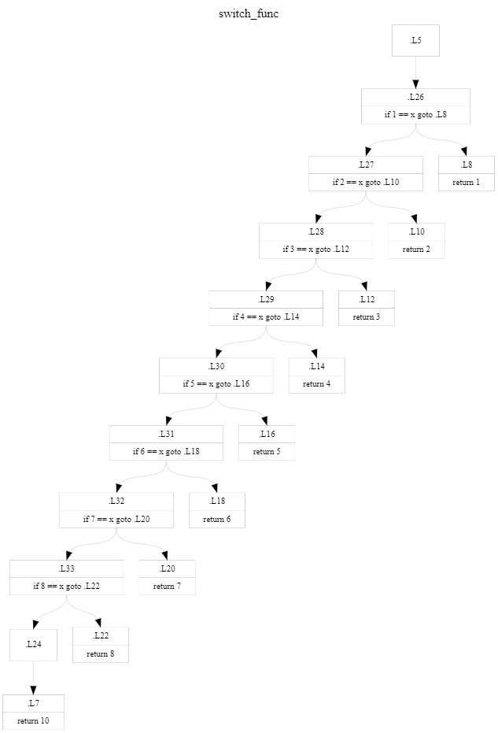
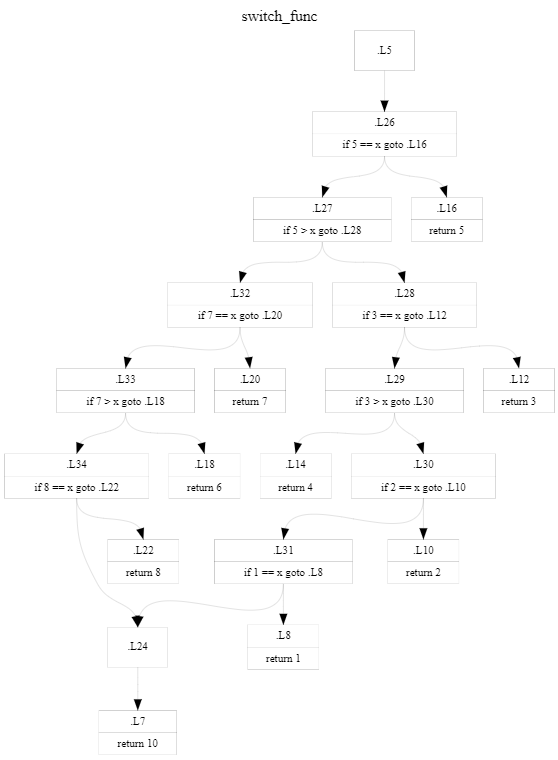
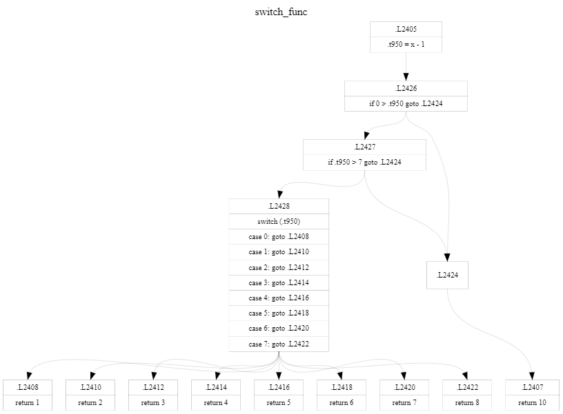

# Some Technical Notes

This is my small note of what I have done in the development.

## Loop condition at the bottom of loop

Loop condition was moved to the bottom of the loop.
For example, here is the `sum` function.

```c
int sum(int n)
{
    int r = 0;
    for (int i = 1; i <= n; ++i) {
        r += i;
    }
    return r;
}
```

The original `lacc` generates the code below.
There are 2 `jmp` instructions in the loop.

```asm
sum:
    push    %rbp
    movq    %rsp, %rbp
    subq    $32, %rsp
    movl    %edi, -8(%rbp)
.L5:
    movl    $0, -16(%rbp)
    movl    $1, -24(%rbp)

; ------------------------------------------ main loop
.L6:
    movl    -24(%rbp), %eax
    cmpl    %eax, -8(%rbp)
    jnge    .L9
.L7:
    movl    -24(%rbp), %eax
    addl    %eax, -16(%rbp)
.L8:
    addl    $1, -24(%rbp)
    jmp     .L6
; ------------------------------------------

.L9:
    movl    -16(%rbp), %eax
    leave
    ret
```

`kcc` generates the code below.
The main loop is the blocks from `.L7` to `.L9`.
You will see the `jmp` instruction is only 1 instruction in the loop.
This means a non-conditional jump has been erased from inside the loop.

```asm
sum:
    pushq   %rbp
    movq    %rsp, %rbp
    subq    $32, %rsp
    movl    %edi, -8(%rbp)
.L5:
    movl    $0, -16(%rbp)
    movl    $1, -24(%rbp)
.L6:
    jmp     .L9

; ------------------------------------------ main loop
.L7:
    movl    -24(%rbp), %eax
    addl    %eax, -16(%rbp)
.L8:
    addl    $1, -24(%rbp)
.L9:
    movl    -24(%rbp), %eax
    cmpl    %eax, -8(%rbp)
    jge     .L7
; ------------------------------------------

.L10:
    movl    -16(%rbp), %eax
    leave
    ret
```

## Binary search for switch-case

I added a binary search algorithm for the switch-case statement.
But unfortunately it gives us not so big improvement.
Now as tests has been passed with both algorithms,
then it uses a binary search when the count of branches are 4 or more.

For the switch case below:

```c
int switch_func(int x)
{
    switch (x) {
    case 1: return 1;
    case 2: return 2;
    case 3: return 3;
    case 4: return 4;
    case 5: return 5;
    case 6: return 6;
    case 7: return 7;
    case 8: return 8;
    default:
        break;
    }
    return 10;
}
```

Here is the original algorithm.
It is a simple 'if-else'.



Here is a binary search algorithm, and you will see the number of comparison is increased.
That would be one of the reasons why there is not so improved.



## Jump table for switch-case

I finally added the code of jump table for switch case.
The above example code is compiled as below.

> Don't care about a big label number and a difference label between the graph and the assemble code.

As you see, I also added the code to output the dot.



Assembled JIT code is now:

```asm
                                  .L2453
0000C83F: 8B 45 F0                      movl    -16(%rbp), %eax
0000C842: FF C8                         decl    %eax
0000C844: 89 C3                         movl    %eax, %ebx
                                  .L2474
0000C846: 83 FB 00                      cmpl    $0, %ebx
0000C849: 0F 8D 0C 00 00 00             jge     .L2475
                                  .L2472
                                  .L2455
0000C84F: B8 0A 00 00 00                movl    $10, %eax
0000C854: 48 8D 65 F8                   leaq    -8(%rbp), %rsp
0000C858: 5B                            popq    %rbx
0000C859: C9                            leave
0000C85A: C3                            ret
                                  .L2475
0000C85B: 83 FB 07                      cmpl    $7, %ebx
0000C85E: 0F 8F EB FF FF FF             jg      .L2472
                                  .L2476
0000C864: 48 31 C0                      xorq    %rax, %rax
0000C867: 89 D8                         movl    %ebx, %eax
0000C869: 48 8D 0D 03 00 00 00          leaq    .T1(%rip), %rcx
0000C870: FF 24 C1                      jmp     *(%rcx,%rax,8)
                                  .T1
0000C873: B3 C8 94 67 46 00 00 00       .L2456
0000C87B: BF C8 94 67 46 00 00 00       .L2458
0000C883: CB C8 94 67 46 00 00 00       .L2460
0000C88B: D7 C8 94 67 46 00 00 00       .L2462
0000C893: E3 C8 94 67 46 00 00 00       .L2464
0000C89B: EF C8 94 67 46 00 00 00       .L2466
0000C8A3: FB C8 94 67 46 00 00 00       .L2468
0000C8AB: 07 C9 94 67 46 00 00 00       .L2470
                                  .L2456
0000C8B3: B8 01 00 00 00                movl    $1, %eax
0000C8B8: 48 8D 65 F8                   leaq    -8(%rbp), %rsp
0000C8BC: 5B                            popq    %rbx
0000C8BD: C9                            leave
0000C8BE: C3                            ret
                                  .L2458
                                        ...
                                        ...
```

When it is the VM code, see below.

```asm
  .L2405
      8125:     push                    [BP-24] : x(i32)
      8126:     dec                     ((object))
      8127:     pop                     [BP+0] : .t950(i32)
  .L2426
      8128:     push(32)                0 (0x0)
      8129:     push                    [BP+0] : .t950(i32)
      8130:     gt                      (i32)
      8131:     jnz                     * +31 <.L2424>
  .L2427
      8132:     push                    [BP+0] : .t950(i32)
      8133:     push(32)                7 (0x7)
      8134:     gt                      (i32)
      8135:     jnz                     * +27 <.L2424>
  .L2428
      8136:     push                    [BP+0] : .t950(i32)
      8137:     jmptabl
      8138:       - entry               * +8 <.L2408>
      8139:       - entry               * +9 <.L2410>
      8140:       - entry               * +10 <.L2412>
      8141:       - entry               * +11 <.L2414>
      8142:       - entry               * +12 <.L2416>
      8143:       - entry               * +13 <.L2418>
      8144:       - entry               * +14 <.L2420>
      8145:       - entry               * +15 <.L2422>
  .L2408
      8146:     push(32)                1 (0x1)
      8147:     ret                     (4)
  .L2410
    ...
    ...
```

Notes: The threshold between items are that the interval each item is less than 16 now.
If there is the interval over threshold, then use binary search algorithm.
Threfore I prefer you change the code if you write the code like below. 

```c
switch (x) {
case 1: ...; break;
case 2: ...; break;
case 3: ...; break;
case 4: ...; break;
case 5: ...; break;
case 100: xxx; break;
default: yyy; break;
}
```

You can write it like below if you want.

```c
switch (x) {
case 1: ...; break;
case 2: ...; break;
case 3: ...; break;
case 4: ...; break;
case 5: ...; break;
default:
    if (x == 100) {
        xxx;
    } else {
        yyy;
    }
    break;
}
```

I may try the improvement for this, if I have time.

## Calling convention between Microsoft x64 and System V

This is only for Windows, and not for Linux.
Basically, the differences between conventions are below.

|           | Arg(1) | Arg(2) | Arg(3) | Arg(4) | Arg(5)  | Arg(6)  | ... and more |
| --------- | :----: | :----: | :----: | :----: | :-----: | :-----: | :----------: |
| Microsoft | `rcx`  | `rdx`  |  `r8`  |  `r9`  | (stack) | (stack) |   (stack)    |
| System V  | `rdi`  | `rsi`  | `rdx`  | `rcx`  |  `r8`   |  `r9`   |   (stack)    |

And also for SSE, it uses `xmm0` to `xmm3` for Microsoft and uses `xmm0` to `xmm7` for System V.
But when those are mixed, it is pretty complex.

Here is the example.

|           | Arg(1)<br />`int` | Arg(2)<br />`double` | Arg(3)<br />`int` | Arg(4)<br />`double` |
| --------- | :---------------: | :------------------: | :---------------: | :------------------: |
| Microsoft |       `ecx`       |        `xmm1`        |       `r8d`       |        `xmm3`        |
| System V  |       `edi`       |        `xmm0`        |       `esi`       |        `xmm1`        |

The register position is fixed for Microsoft, but not for System V.
The position on the System V style is assigned from the first register in order.

Currently the convertion between these styles is done only when calling builtin functions on JIT.
These differences do not have to be cared inside JIT code
because the compiled code is always generated with System V style.
It means this convertion is needed only when calling builtin functions
compiled as Microsoft calling convention.

Anyway now, this complexibility causes it is too hassle to generate call back
from a native function to a JIT code.

Would you please try it?
